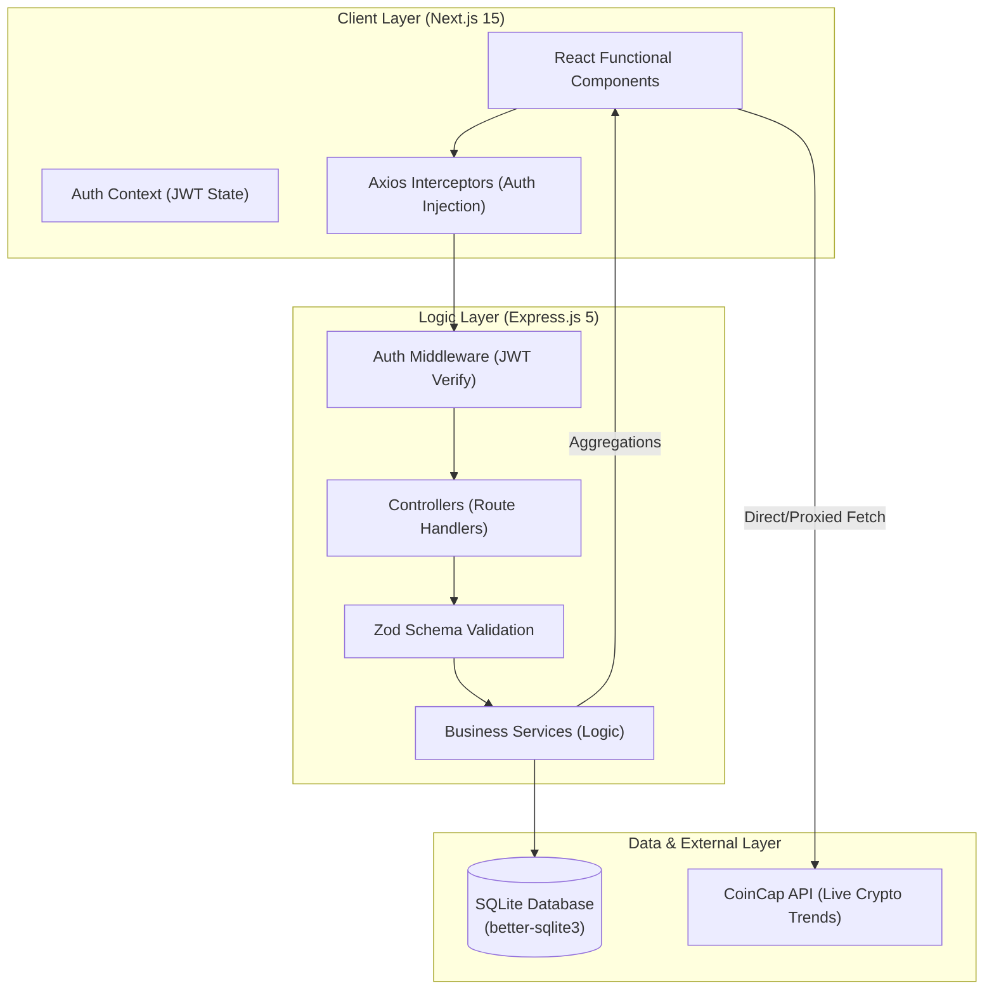
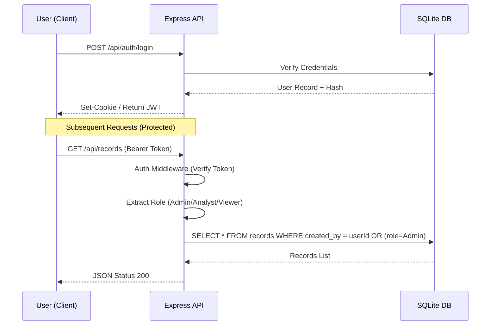
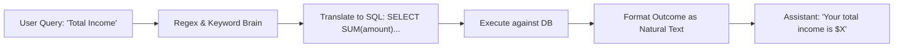
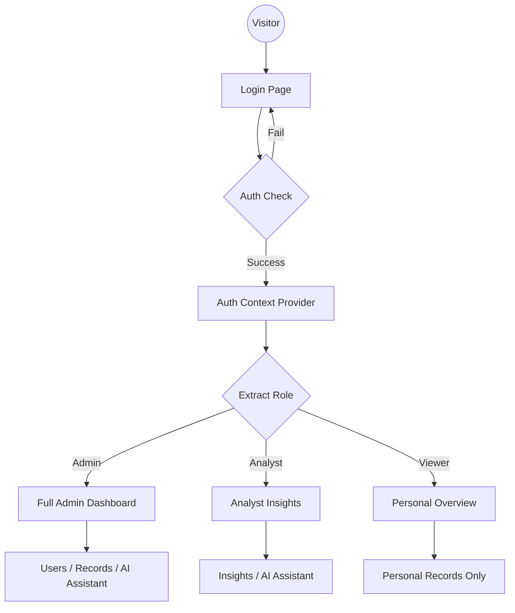

# Zorvyn Financial Management Dashboard 🚀

A premium, full-stack Role-Based Access Control (RBAC) finance dashboard built for professional assignment presentation. This application demonstrates secure user authentication, complex data visualization, real-time API integrations, and an AI-driven financial assistant.

---

## 🌟 Key Features

### 1. Robust Role-Based Access Control (RBAC)
*   🛡️ **Admin:** Full control over all users and every single financial record in the system. Can create, edit, or delete any entry.
*   📊 **Analyst:** Advanced access to "Insights" (charts) and the full company transaction history. Access to the AI Assistant for data analysis.
*   👁️ **Viewer:** Limited to seeing their own personal "Overview" and managing their private records. Restricted from seeing cross-user data or user management.

### 2. Multi-API Integration
*   📈 **Market Data:** Integrated **CoinCap API** for real-time cryptocurrency price tracking directly on the dashboard.
*   🧠 **AI Assistant:** A secure, logic-driven **Financial Chatbot** (Admin/Analyst only). It translates natural language into database queries to show summaries instantly.

### 3. Professional Data Visualization
*   🎨 **Interactive Charts:** Powered by **Recharts**, featuring monthly spending trends and category distribution pie charts.
*   📑 **Transaction Management:** Full CRUD (Create, Read, Update, Delete) capability with secure backend validation.
*   🔍 **Advanced Filtering:** Filter transactions by **Type, Category, or Specific Date** instantly.

### 4. Enterprise-Grade Security
*   🔑 **JWT Authentication:** Secure stateless session management with salted password hashing.
*   🔒 **Route Guarding:** Protected routes in both the Frontend (Next.js) and Backend (Express.js).

---

## 🛠️ Technology Stack

| Layer | Technologies |
| :--- | :--- |
| **Frontend** | Next.js 15, Tailwind CSS v4, Lucide Icons, Axios, Recharts |
| **Backend** | Node.js, Express.js 5, TypeScript |
| **Database** | SQLite (`better-sqlite3`) — Fast, self-contained, and persistent |
| **Auth** | JSON Web Tokens (JWT), Bcrypt.js |

---

## 🏗️ Architecture & Data Flow

### 🛰️ High-Level System Architecture
The application follows a modern 3-tier architecture with a Next.js Frontend, a Node.js Express Backend, and a local SQLite Database.



### 🔐 Authentication & RBAC Flow
Strict **Role-Based Access Control** is enforced at the API level for every request.



### 🤖 Smart Chat Assistant Flow
The internal AI uses a **Logic-Based Parser** to translate natural English into database facts in milliseconds.



### 🌊 User Navigation Flow
The following diagram illustrates the seamless path a user takes from landing on the application to accessing their role-specific insights.



---

## 🚀 Getting Started

### 1. Prerequisites
*   Node.js (v18 or higher)
*   npm

### 2. Installation
```powershell
# Clone the repository and install dependencies
npm install
```

### 3. Run the Application
```powershell
# Start both Backend and Frontend concurrently
npm run dev
```
*   **Frontend:** `http://localhost:3000`
*   **API Server:** `http://localhost:4000`

### 4. Test Accounts (Password: `Admin@1234`)
*   **Admin:** `test1@finance.com`
*   **Analyst:** `test2@finance.com`
*   **Viewer:** `test3@finance.com`

---

## 💡 Developer Notes
*   **Seeding:** The database is automatically seeded with 50+ realistic historic records for `test1@finance.com` on the first run to ensure the dashboard looks "full" and professional immediately.
*   **Resiliency:** The market data feature includes an automatic **Mock Fallback**—if the internet is disconnected or the API is down, the dashboard still displays beautiful high-quality market data instead of empty boxes.
*   **AI Smart Brain:** The chatbot uses optimized regex and SQL mapping to perform "natural language processing" without requiring expensive external API tokens.

---

**Developed for the Zorvyn Assignment Portfolio.**
